# pichincha-challenge-1
Coding challenge to build a currency exchange REST API

## Functional requirements
- Input would be user ID, amount, origin & destination currencies
- Output would be the exchange rate and converted amount
- Validate if the user id exists and get the name from an external API
- Public services like http://gorest.co.in/public/v2/users could be integrated for user check
- For each conversation performed, it should store a log into a local DB
- Log should contain user name, amounts before & after conversion, exchange rate and date of transaction

## Technical requirements
- Stack should be Java language, Spring boot framework, Webflux reactive
- For local testing, we could use H2 DB for persistence and Postman
- Aspects to consider like exception handling and API documentation with Swagger
- Secure the endpoint using JWT based authentication (token generation not considered)
- Unit testing of rest and service layers

-----------------------------------

## Testing of solution

### Currency exchange API Testing

1. We could generate a testing token to include it in the 'authentication' header
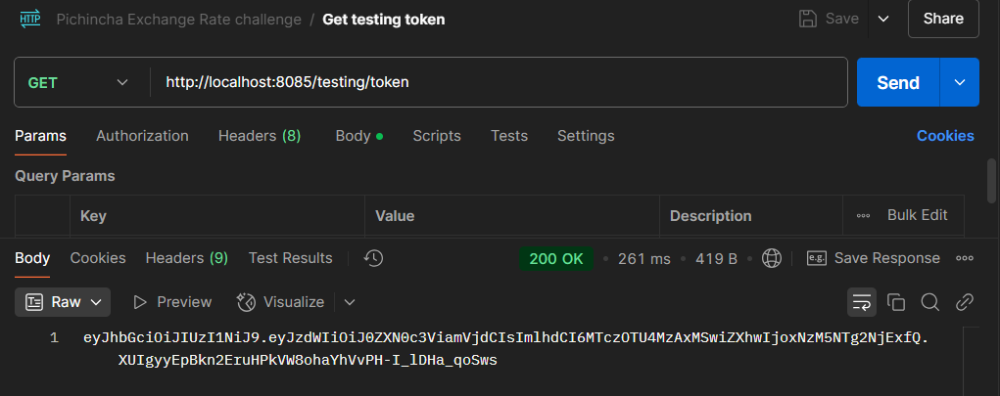
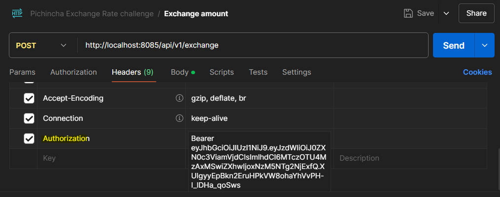

2. Then, pick one user from the external API
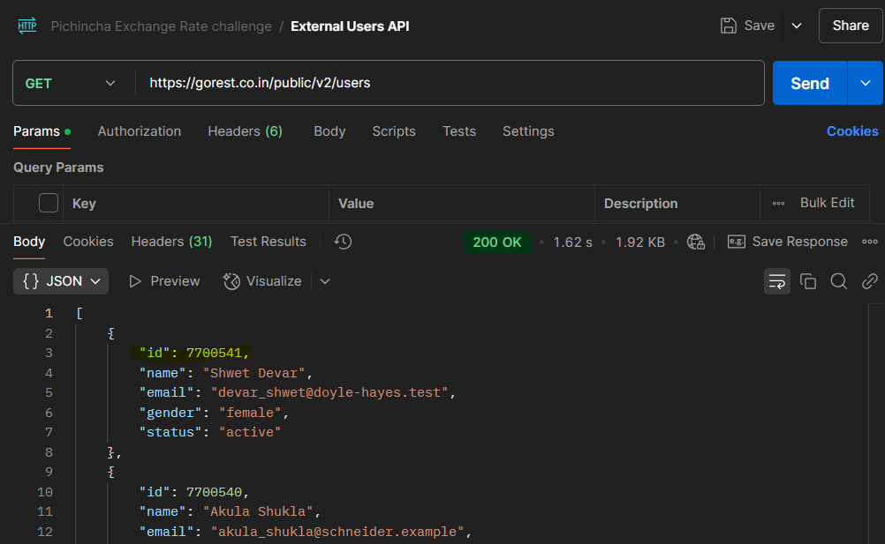

3. Finally, we could hit the exchange API, providing the userId
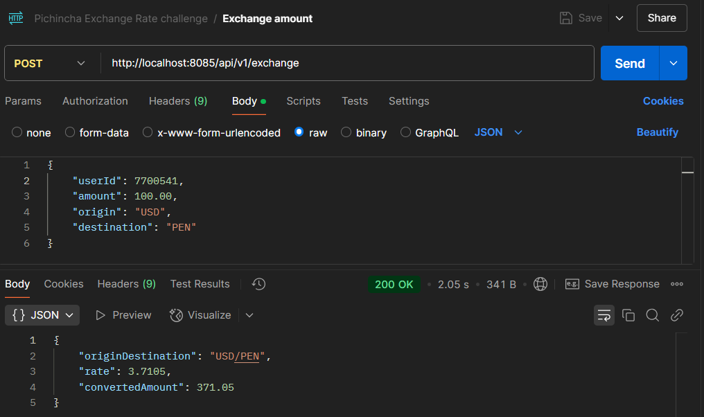

User log should be saved in H2 DB 'user_exchange_log' table
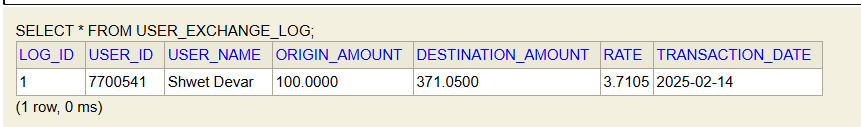

Note: Exchange rates are preloaded in H2 table
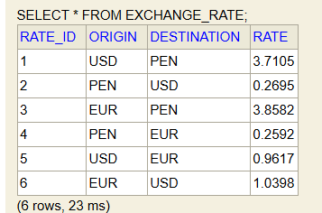

4. One error case would be when exchange currency is not available
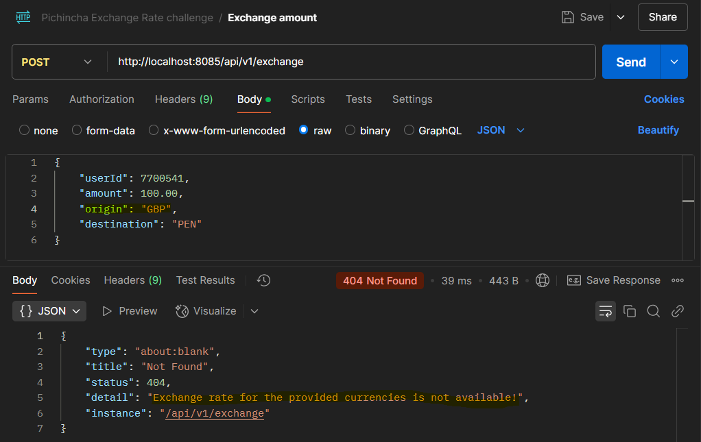

5. Another error would be when user id is not found
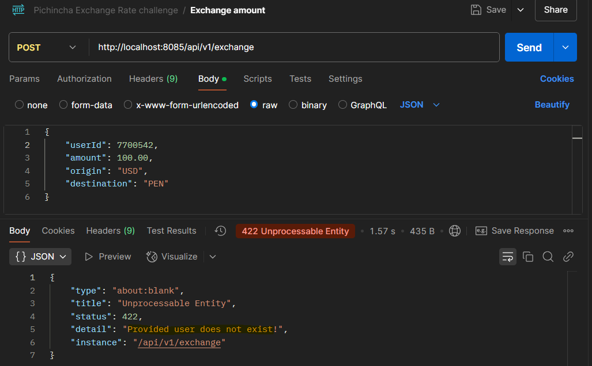

6. Also if JWT token is not provided or invalid we get an unauthorized response
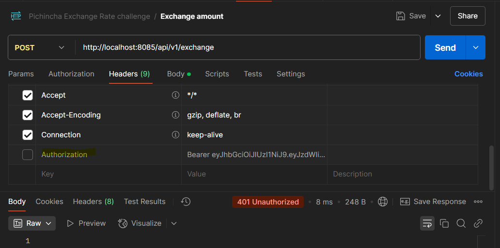

### Swagger docs
Swagger documentation info was provided and enabled in UI.
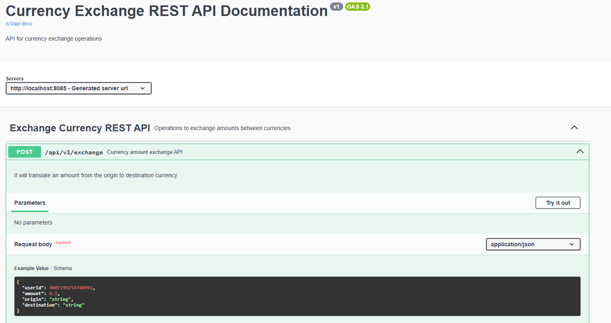
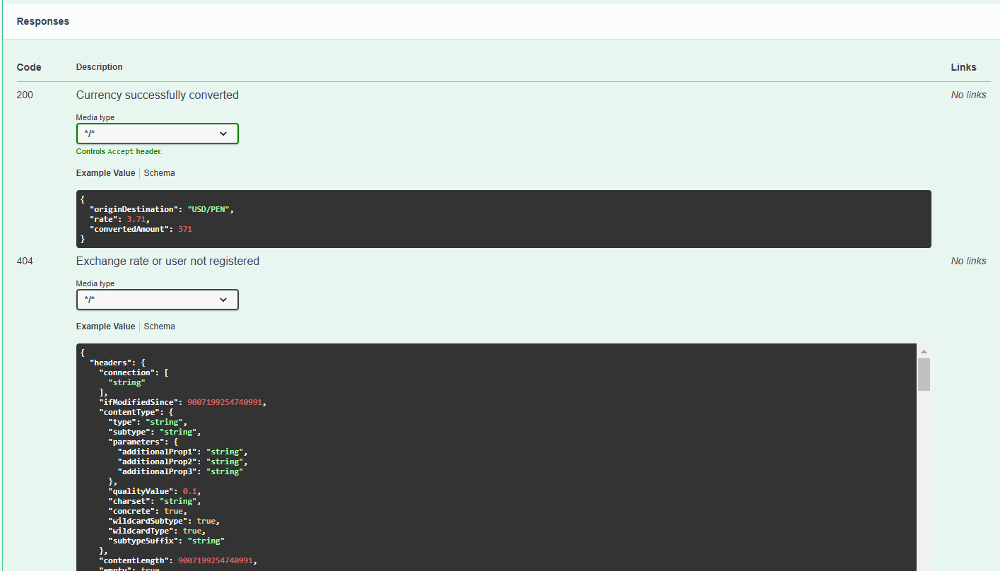

### Testing coverage
1. Rest layer completely covered
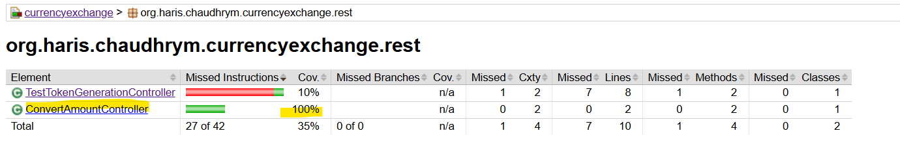

2. Service layer has 94% coverage
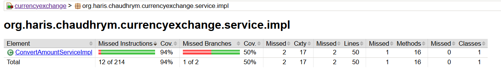

